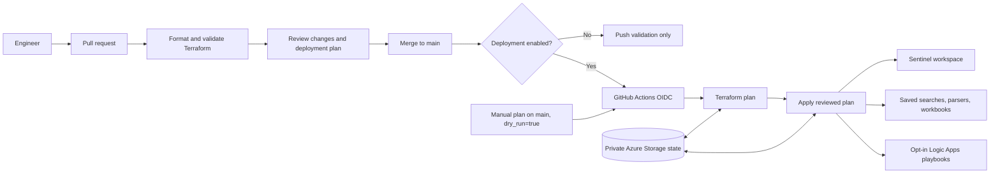

## Overview

This repository manages Microsoft Sentinel content from the
[sentinel-as-code source repository](https://github.com/urosbabic/sentinel-as-code)
with Terraform and GitHub Actions OpenID Connect (OIDC). AzureRM looks up the
target workspace, and AzAPI manages content types that AzureRM does not expose.

The deployment design and operator runbook are in
[docs/deployment.md](./docs/deployment.md).



The migration includes 68 analytic rule YAML files, 36 hunting queries, two
KQL parsers, four workbooks, four Logic App ARM templates, and one standalone
Logic App definition. One source query had a `.kqll` extension and was renamed
to `.kql`. The source repository did not contain automation rule definitions;
the Terraform deployment support is ready for new JSON manifests.

## Managed content

| Directory | Content | Deployment |
| --- | --- | --- |
| `content/analytics-rules/` | Scheduled and NRT analytic rules | Sentinel alert-rule API |
| `content/automation-rules/` | Automation rule JSON manifests | Sentinel automation-rule API |
| `content/hunting-queries/` | KQL hunting queries | Log Analytics saved searches |
| `content/parsers/` | KQL workspace functions | Log Analytics saved searches |
| `content/playbooks/` | Logic App templates and definitions | ARM deployments and Logic App API |
| `content/workbooks/` | Workbook JSON | Workbook API |

The migration copies content assets, not the source repository's deployment
scripts, Codeless Connector Framework, test data, or Microsoft Defender XDR
custom detections. Those assets require separate deployment models.

## Review before deployment

The existing Azure workspace may already contain content from the source
repository. A new Terraform state will plan to create every migrated resource.
The current inventory confirmed 50 existing analytic rules and 18 absent
rules. Import declarations cover those 50 rules; review the remote plan for
drift before applying. Other content types still need comparison against the
target workspace.

Playbooks are opt-in. Add their directory names to `enabled_playbooks` only
after providing required ARM parameters or managed API connections and
reviewing external permissions. The standalone
`Incident-DisableUserAccount` workflow uses Microsoft Graph through a managed
identity; its Graph permissions and connector references must be configured
separately. ARM template deployments are tracked as deployment operations,
not as individual child resources.

Terraform variables containing playbook parameters or connection details are
marked sensitive, but values can still be present in Terraform state. Do not
put credentials in content files or commit variable files. Use a protected
remote state backend and review each playbook's secret-handling requirements
before enabling it.

## Prerequisites

* Terraform 1.6 or later
* A Log Analytics workspace onboarded to Microsoft Sentinel
* An Entra application with a federated credential for the GitHub `production`
  environment
* A private Azure Storage blob container for remote Terraform state
* Microsoft Sentinel Contributor on the target workspace
* Workbook Contributor on the target resource group when deploying workbooks
* Storage Blob Data Contributor on the state container
* Logic Apps Contributor on the target resource group if deploying playbooks

## Configure GitHub

The `GitHub Actions - sentinel-terraform` application uses a single-tenant
federated identity in SoftwareOne. Its issuer is
`https://token.actions.githubusercontent.com`, its audience is
`api://AzureADTokenExchange`, and its subject is
`repo:urosbabic/sentinel-terraform:environment:production`. No client secret is
used for Azure authentication.

Set these repository or `production` environment variables:

| Variable | Purpose |
| --- | --- |
| `AZURE_CLIENT_ID` | Entra application client ID |
| `AZURE_TENANT_ID` | SoftwareOne tenant ID: `83a97caa-ea6c-4849-8077-441cd6e3c0dc` |
| `AZURE_SUBSCRIPTION_ID` | Subscription containing the workspace and state account |
| `SENTINEL_RESOURCE_GROUP` | Resource group containing the Sentinel workspace |
| `SENTINEL_WORKSPACE_NAME` | Log Analytics workspace name |
| `TF_STATE_RESOURCE_GROUP` | Resource group containing the state account |
| `TF_STATE_STORAGE_ACCOUNT` | Terraform state storage account |
| `TF_STATE_CONTAINER` | Terraform state blob container |
| `ENABLE_SENTINEL_DEPLOYMENT` | Set to `true` only after imports and plan review |
| `ENABLED_PLAYBOOKS` | Optional JSON array of playbook directory names, default `[]` |

For selected playbooks, add the JSON values for `PLAYBOOK_PARAMETERS_JSON` and
`PLAYBOOK_CONNECTIONS_JSON` as secrets in the `production` environment. Both
values default to `{}` when unset.

The target is the `Sentinel-LAW` workspace in `Sentinel-RG`, in the MVP Azure
subscription (`6ad437fe-2b06-40f9-8409-0d6cd0dc0e37`). The application client ID
is `eda454ec-ab8e-473a-b738-fa1b873fed77`.

## Deployment status

The dedicated state storage account and private `tfstate` container have been
created. Shared-key access is disabled, state versioning and soft delete are
enabled, and the bootstrap Terraform state has been migrated to the Azure
backend. GitHub repository variables for the state resource group, account,
and container are configured. Temporary operator access to the state
container was removed after migration.

The first remote apply partially deployed content and imported the 50 existing
analytic rules. It created the hunting queries and parsers, and applied valid
rule changes before Azure rejected 21 analytic-rule operations for invalid
metadata, entity mappings, or query references. Workbook creation also failed
because the deployment identity lacked workbook write permission; that role
has since been assigned but still needs verification by a deployment run.

The latest remote plan reports 22 additions, five changes, and no deletions:
18 analytic-rule additions, five analytic-rule changes, and four workbooks.
Two rule changes were not among the rejected operations. A targeted manual
plan can deploy the four workbooks and those two rule changes while leaving
the rejected rules for later repair. The deployment gate remains disabled
unless temporarily enabled for an explicitly approved apply.

## Bootstrap the state backend

The bootstrap stack creates a dedicated StorageV2 account and private `tfstate`
container with blob versioning and soft delete. It disables shared-key access
and grants the GitHub service principal Storage Blob Data Contributor only on
the state container. It grants Microsoft Sentinel Contributor only on the
workspace. Logic Apps Contributor is not granted unless explicitly requested.

Sign in to SoftwareOne and inspect the plan before applying:

```powershell
az login --tenant 83a97caa-ea6c-4849-8077-441cd6e3c0dc
$env:ARM_SUBSCRIPTION_ID = "6ad437fe-2b06-40f9-8409-0d6cd0dc0e37"
terraform -chdir=bootstrap init -backend=false
terraform -chdir=bootstrap validate
terraform -chdir=bootstrap plan `
  -var="github_actions_service_principal_object_id=58b03d35-ab11-44fc-87c0-2b6c48d5a42a"
```

After reviewing the plan, create the state resources:

```powershell
terraform -chdir=bootstrap apply `
  -var="github_actions_service_principal_object_id=58b03d35-ab11-44fc-87c0-2b6c48d5a42a"
```

The default account name is `stsentineltfstateuros01`. Azure storage account
names are globally unique, so change `storage_account_name` if that name is
unavailable. Set the three `TF_STATE_*` GitHub variables from the bootstrap
outputs.

Migrate the bootstrap local state to the new backend with key
`bootstrap.tfstate`, then initialize the main stack with key
`sentinel-terraform.tfstate`:

```powershell
terraform -chdir=bootstrap init -migrate-state `
  -backend-config="resource_group_name=Sentinel-RG" `
  -backend-config="storage_account_name=stsentineltfstateuros01" `
  -backend-config="container_name=tfstate" `
  -backend-config="key=bootstrap.tfstate" `
  -backend-config="use_azuread_auth=true"

terraform -chdir=terraform init `
  -backend-config="resource_group_name=Sentinel-RG" `
  -backend-config="storage_account_name=stsentineltfstateuros01" `
  -backend-config="container_name=tfstate" `
  -backend-config="key=sentinel-terraform.tfstate" `
  -backend-config="use_azuread_auth=true"
```

The bootstrap migration is complete for this repository. The deployment
identity has Blob Data access to the state container; the interactive operator
identity does not retain Blob Data access. Run subsequent authenticated
Terraform operations through the configured GitHub Actions environment, or
use a separately approved temporary access procedure.

Restrict the `production` environment to the `main` branch and configure
required reviewers if deployments need manual approval. Pull request jobs do
not receive Azure credentials. Deployment stays disabled until
`ENABLE_SENTINEL_DEPLOYMENT` is set to `true`.

## Workflow behavior

Pull requests run formatting and validation for both Terraform stacks without
Azure credentials. Pushes to `main` and manual runs create a Terraform plan
when `ENABLE_SENTINEL_DEPLOYMENT` is `true`. Manual runs default to dry-run;
set the `dry_run` input to `false` to apply. A push to `main` applies the
reviewed plan when deployment is enabled.

## Deployment guide

Follow the [deployment guide](./docs/deployment.md) for first-time setup,
existing-content import checks, manual dry runs, and production rollout.

## Run locally

Copy `terraform/terraform.tfvars.example` to
`terraform/terraform.tfvars`, then initialize and validate the main stack:

```powershell
az login --tenant 83a97caa-ea6c-4849-8077-441cd6e3c0dc
terraform -chdir=terraform init `
  -backend-config="resource_group_name=<state-resource-group>" `
  -backend-config="storage_account_name=<state-storage-account>" `
  -backend-config="container_name=<state-container>" `
  -backend-config="key=sentinel-terraform.tfstate" `
  -backend-config="use_azuread_auth=true"
terraform -chdir=terraform fmt -check -recursive
terraform -chdir=terraform validate
terraform -chdir=terraform plan
```

Review the plan before applying it. Never commit Terraform state, plan files,
or `terraform.tfvars`.
