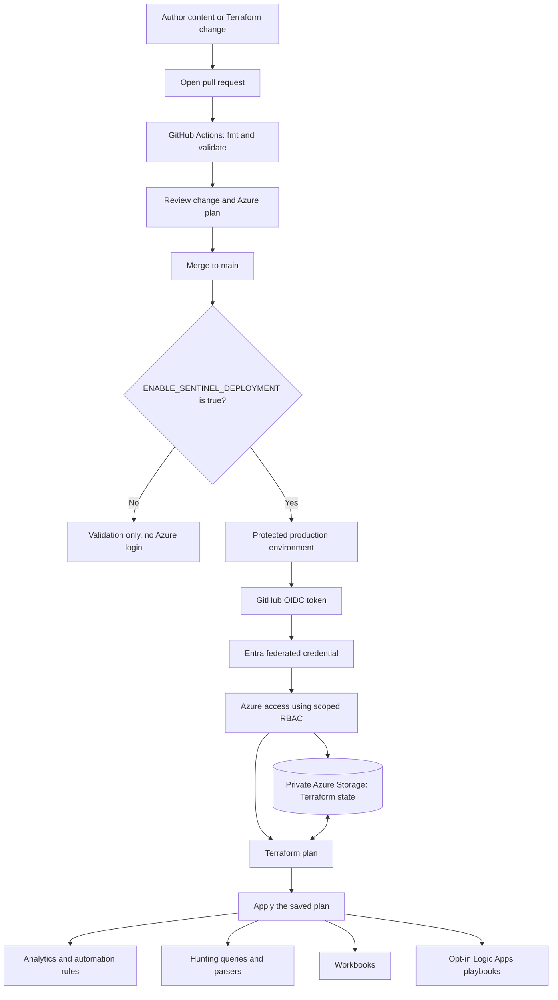

## Deployment flow



Pull requests validate formatting and both Terraform configurations without
Azure credentials. The deployment job runs only on pushes to `main` or manual
workflow runs, and receives an OIDC token only inside the protected
`production` environment.

When enabled, pushes to `main` automatically apply the saved Terraform plan.
A manual run defaults to dry-run: it creates and displays a plan but does not
apply it. Set the `dry_run` input to `false` only after reviewing the plan.

## Managed content

Terraform discovers files under `content/` and manages these resources:

| Content directory | Azure resource |
| --- | --- |
| `content/analytics-rules/` | Microsoft Sentinel alert rules, scheduled and NRT |
| `content/automation-rules/` | Microsoft Sentinel automation rules |
| `content/hunting-queries/` | Log Analytics saved searches |
| `content/parsers/` | Log Analytics saved searches configured as functions |
| `content/workbooks/` | Azure Monitor workbooks |
| `content/playbooks/` | Logic App workflows and ARM template deployments |

Automation rule support is ready for new JSON definitions, but the source
repository did not include automation rule manifests. Playbooks are opt-in and
are not deployed unless named in `ENABLED_PLAYBOOKS`. Configure their connector
connections, external permissions, and secure parameters before enabling them.

## Current rollout status

The dedicated Azure state storage account and private `tfstate` container have
been created. Shared-key access is disabled, versioning and soft delete are
enabled, the bootstrap state has been migrated to Azure Storage, and the three
GitHub `TF_STATE_*` variables are configured. Temporary operator Blob Data
access was removed after the migration.

Sentinel content deployment remains disabled. A current local plan predicts
111 resources to add and no changes or deletions. This is a pre-deployment
plan, not proof that those resources are absent from the target workspace.
Inventory the workspace and import matching resources before enabling the
deployment gate.

## First-time setup

### 1. Configure identity and environment

Use the `GitHub Actions - sentinel-terraform` Entra application and its
federated credential for
`repo:urosbabic/sentinel-terraform:environment:production`. The GitHub
`production` environment should allow deployments from `main`; add required
reviewers if production changes need an approval gate.

Configure these GitHub Actions variables:

| Variable | Purpose |
| --- | --- |
| `AZURE_CLIENT_ID` | Entra application client ID |
| `AZURE_TENANT_ID` | SoftwareOne tenant ID |
| `AZURE_SUBSCRIPTION_ID` | Subscription containing Sentinel and state |
| `SENTINEL_RESOURCE_GROUP` | Resource group containing the target workspace |
| `SENTINEL_WORKSPACE_NAME` | Target Log Analytics workspace |
| `TF_STATE_RESOURCE_GROUP` | Resource group containing the state account |
| `TF_STATE_STORAGE_ACCOUNT` | State storage account name |
| `TF_STATE_CONTAINER` | State container name, `tfstate` |
| `ENABLE_SENTINEL_DEPLOYMENT` | Keep unset or `false` until readiness checks pass |
| `ENABLED_PLAYBOOKS` | Optional JSON array of playbook directory names |

Playbook deployments may also need `PLAYBOOK_PARAMETERS_JSON` and
`PLAYBOOK_CONNECTIONS_JSON` environment secrets. Terraform state can contain
these values even when variables are marked sensitive. Keep the state backend
private and restrict access to it.

The deployment identity requires Microsoft Sentinel Contributor on the
workspace and Storage Blob Data Contributor on the state container. Grant
Logic Apps Contributor on the resource group only when playbooks need
deployment. Review any additional permissions required by a playbook
separately.

### 2. Create and secure remote state

The `bootstrap/` Terraform stack creates a dedicated StorageV2 account, a
private `tfstate` container, versioning, and soft-delete protections. It
disables shared-key access and assigns the deployment identity access to the
state container. Its plan and apply are separate from the Sentinel deployment.

Sign in and inspect the bootstrap plan before applying:

```powershell
az login --tenant 83a97caa-ea6c-4849-8077-441cd6e3c0dc
$env:ARM_SUBSCRIPTION_ID = "6ad437fe-2b06-40f9-8409-0d6cd0dc0e37"
terraform -chdir=bootstrap init -backend=false
terraform -chdir=bootstrap validate
terraform -chdir=bootstrap plan `
  -var="github_actions_service_principal_object_id=58b03d35-ab11-44fc-87c0-2b6c48d5a42a"
```

After a human reviews the plan, apply the bootstrap configuration:

```powershell
terraform -chdir=bootstrap apply `
  -var="github_actions_service_principal_object_id=58b03d35-ab11-44fc-87c0-2b6c48d5a42a"
```

The default storage account name is `stsentineltfstateuros01`; storage account
names must be globally unique. Change the name if Azure reports that it is
already taken. Configure the three `TF_STATE_*` GitHub variables from the
bootstrap outputs.

Migrate the bootstrap stack's local state to the new backend, then initialize
the deployment stack. Keep separate backend keys for the two state files:

```powershell
terraform -chdir=bootstrap init -migrate-state `
  -backend-config="resource_group_name=<state-resource-group>" `
  -backend-config="storage_account_name=<state-storage-account>" `
  -backend-config="container_name=tfstate" `
  -backend-config="key=bootstrap.tfstate" `
  -backend-config="use_azuread_auth=true"

terraform -chdir=terraform init `
  -backend-config="resource_group_name=<state-resource-group>" `
  -backend-config="storage_account_name=<state-storage-account>" `
  -backend-config="container_name=tfstate" `
  -backend-config="key=sentinel-terraform.tfstate" `
  -backend-config="use_azuread_auth=true"
```

### 3. Inventory and import existing content

Before enabling deployment, inventory the target workspace and compare it with
the files in `content/`. A fresh Terraform state considers every discovered
file to be new. Import resources already present in Azure into the matching
Terraform addresses before applying; otherwise Terraform can attempt duplicate
creates or fail because a resource name already exists.

Use each resource's exact Azure resource ID and the Terraform address generated
from its relative content path. For example, the analytic rule address is
`azapi_resource.analytics_rule["AzureActivity/new_dcr_creation_detection_rule.yaml"]`.
Azure resource IDs for the other content types are available through the
resource provider APIs or Azure portal. After each import, run `terraform plan`
and resolve differences between the deployed object and the source definition.
Do not proceed while the plan proposes unexpected replacements, deletions, or
duplicate creates.

Import the analytic rule with its full Azure resource ID:

```powershell
terraform -chdir=terraform import `
  'azapi_resource.analytics_rule["AzureActivity/new_dcr_creation_detection_rule.yaml"]' `
  '<existing-alert-rule-resource-id>'
```

Repeat with the matching Terraform address and Azure resource ID for each
existing resource. Do not import a resource until its corresponding content
file is present in the repository.

### 4. Review and deploy

Keep `ENABLE_SENTINEL_DEPLOYMENT` unset while preparing the migration. Open a
pull request and review the content, formatting, and validation results. Once
existing resources have been imported and the expected Terraform plan has been
reviewed, enable deployment and merge the approved change to `main`.

For a plan without applying, start the GitHub Actions workflow manually and
leave `dry_run` set to `true`. To apply a reviewed manual plan, set `dry_run`
to `false`. Once the gate is enabled, a push to `main` applies the generated
plan automatically, so protect the branch and require pull request reviews.

## Local validation

Run these commands from PowerShell after configuring the backend:

```powershell
terraform -chdir=terraform fmt -check -recursive
terraform -chdir=terraform validate
terraform -chdir=terraform plan
```

Review the plan before applying. Do not commit `.tfstate` files, saved plans,
or `terraform.tfvars`.
